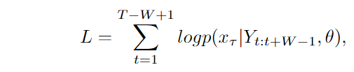
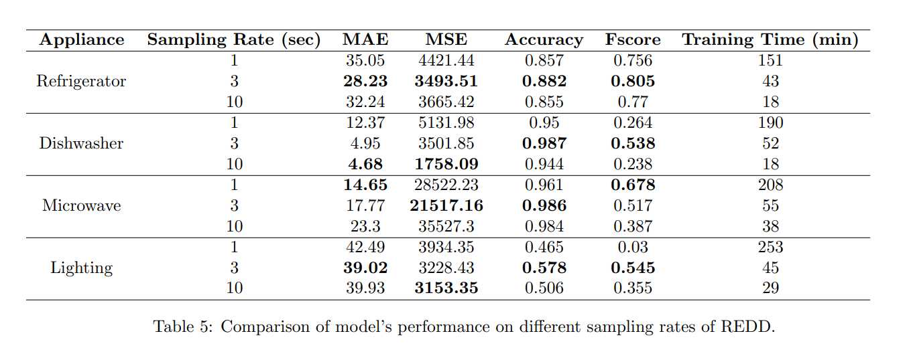
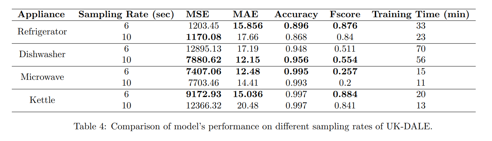

# Sequence-to-point learning for NILM

[](https://www.tensorflow.org/)
[](LICENSE)

## Description

Implementation of the sequence-to-point CNN methodology for Non-Intrusive Load Monitoring as part of a research internship at Powerchainger Groningen.

The seq2point model has been trained and tested on different sampling frequencies of two datasets, namely REDD and UK-DALE. 
Cross-domain testing between the two datasets with an optional fine-tuning step also available. 


## Table of Contents

- [Installation](#installation)
- [Usage](#usage)
- [Methodology](#methodology)
- [Results](#results)

## Installation

Install dependencies in requirements file. 


```bash
pip install -r requirements.txt
```

## Usage

The dataset directory should follow the structure below:

**Data:**

     ```
     ./
     ├── redd
     │   ├── house1.csv
     │   ├── house2.csv
     │   └── ...
     ├── ukdale
     │   ├── house1.csv
     │   └── ...
     └── ...
     ```


All the experiments can be run by executing the following script:

```bash
python ./main_exp.py --train_houses 2 5 --test_houses 1 -sd redd -td redd --device refrigerator -lr 0.001 -e 20 -b 64
```

### Arguments

| Argument                | Type      | Default     | Description                                     |
|-------------------------|-----------|-------------|-------------------------------------------------|
| --train_houses          | int list  | (Required)  | List of houses for training                     |
| --test_houses           | int list  | (Required)  | List of houses for testing                      |
| --device                | str       | refrigerator| Target device to train on                        |
| --nas                   | str       |             | How to deal with missing values. Possible values: 'interpolate', 'drop' |
| -sr, --sampling_rate    | int       | 1           | Target sampling rate                            |
| -st, --standardise      | bool      | False       | Standardize data                                |
| -lr, --learning_rate    | float     | 0.001       | Learning rate for the model                      |
| -e, --epochs            | int       | 20          | Number of training epochs                       |
| -b, --batch             | int       | 32          | Batch size                                      |
| --loss                  | str       | mse         | Loss function to use for training               |
| -sd, --source_domain    | str       | redd        | Which source domain will be used. Options are 'redd' or 'ukdale' |
| -td, --target_domain    | str       | redd        | Which target domain will be used. Options are 'redd' or 'ukdale' |
| -tl, --transfer_learning | bool      | False       | Enable fine tuning                        |


## Methodology

### Sequence-to-point learning

The idea is that the network learns to represent
the midpoint of the appliance sequence given a window of
the total consumption, also referred to as mains, as input.
Specifically, the input of the network consists of sliding
windows of the mains power Yt:t+W −1 and the output is
the midpoint element xτ of the corresponding window of
the target appliance. W represents a predefined window
size and τ = t + ⌊W/2⌋. Thus, it is assumed that the
midpoint element xτ is a nonlinear function of the total
consumption window and it is also expected that the value
of xτ is connected to the information of the mains before
and after it.

The sequence-to-point approach does not perform sequence to sequence mapping, but rather defines a neural
network f that maps the sliding windows Yt:t+W −1 of the
input to the midpoint xτ of the corresponding windows
Xt:t+W −1 of the output. Hence, the network is modelled
as xτ = f (Yt:t+W −1) + ε, where ε is a noise term. The loss
function used to train such a model can be formulated as:




where θ are the model parameters. Finally, in order
to receive predictions for the entire input sequence Y =
(y1, .., yT ), Y is padded with ⌈W/2⌉ zeros on both sides.

 
## Results 

### Resampling experiments

REDD (original resolution 1/3 Hz) is resampled to 1 and 1/10 Hz and UK-DALE (original resolution 1/6 Hz) is downsampled to 1/10 Hz. The model is trained and tested on each one of the sampling frequencies for each 
one of the target devices as seen in the following tables. The provided metrics are product of the model's evaluation on held-out test houses (house 1 for REDD and house 2 for UK-DALE).





Our results suggest that overall, maintaining the original sampling rate has yielded the best performance for the majority of the tested devices. Nonetheless, it is concluded that downsampling can be used as a viable option, when storage space and computational resources are limited and some potential performance drop can be tolerated. The same cannot be stated for upsampling as respective results do not justify the huge increase in training time.
